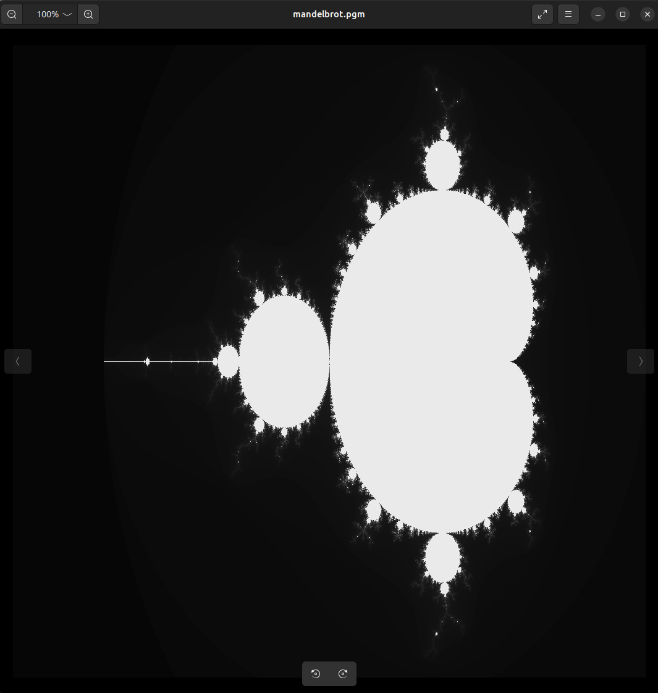
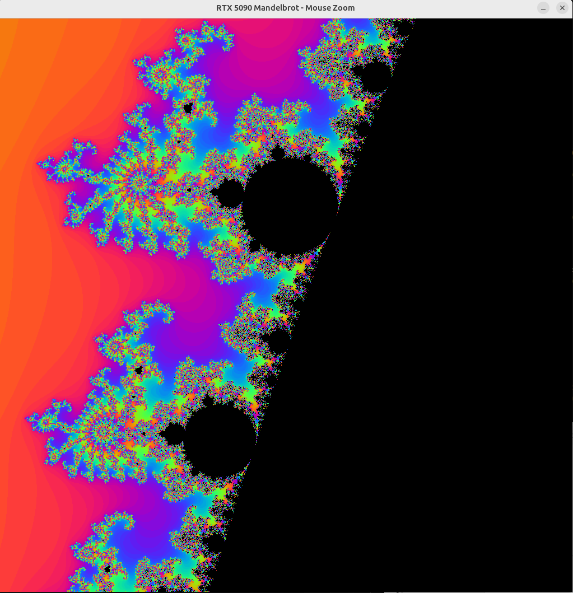

# CUDA_mandelbrot, EMBARRASSINGLY PARELLEL

A straightforward Mandelbrot set renderer written in C++ and CUDA.

The calculation for 1M pixels is effectively instant. The implementation is "embarrassingly parallel"—every pixel is computed in its own independent thread with zero synchronization overhead.

### How to use
With the newest color and zoom version:
mouse1 to zoom in
mouse2 to zoom out

### Key Points
* **Native C++ & CUDA:** No unnecessary wrappers.
* **pgm output:** Generates `.pgm`

### Usage
Requires Linux and the CUDA Toolkit (nvcc).

```bash
make
./mandelbrot
```

### Example result


### Example colored and zoomed version
